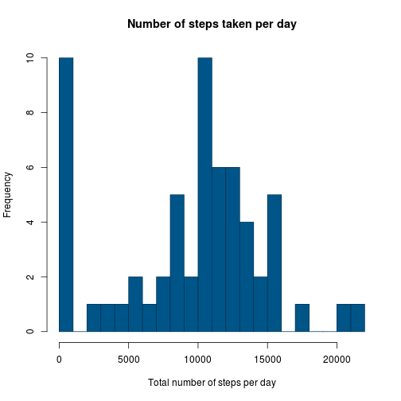

# Reproducible Research: Assignment 1

## Loading and preprocessing the data


```r
data <- read.csv("activity.csv")
```

## What is mean total number of steps taken per day?


### Daily stats (steps per day):


- **Histogram of the total number of steps per day:**


```r
# Number of steps per date
stepsPerDay <- aggregate(data$steps, by=list(data$date), FUN=sum)
stepsPerDay <- setNames(stepsPerDay, c("Date", "StepsNum"))

# Histogram data
stepsDataHist <- as.integer(stepsPerDay[["StepsNum"]])
nbreaks <- max(stepsPerDay[["StepsNum"]], na.rm=TRUE)


# Histogram
hist(stepsDataHist, freq=TRUE, 
	col="#005588", border="#003355", breaks=nbreaks / 1000,
	main="Number of steps taken per day", 
	xlab="Total number of steps per day", ylab="Frequency")
```

 

```r
# Mean and median
stepsMean <- mean(stepsPerDay[["StepsNum"]], na.rm=TRUE)
stepsMedian <- median(stepsPerDay[["StepsNum"]], na.rm=TRUE)
```

- **Mean number of steps per day:** 10766.19

- **Median number of steps per day:** 10765


## What is the average daily activity pattern?

### Average daily patterns (steps per interval):

 - **Time series for the daily average number of steps per interval:**


```r
# Daily average number of steps per interval
avgStepsPerInterval <- aggregate(data$steps, by=list(data$interval), FUN=mean, na.rm=TRUE)
avgStepsPerInterval <- setNames(avgStepsPerInterval, c("Interval", "StepsAvg"))

# Time series
plot(avgStepsPerInterval[["Interval"]], y = avgStepsPerInterval[["StepsAvg"]], 
	type="l", main="Daily average number of steps per interval",
	xlab="Interval", ylab="Number of steps")
```

 

```r
# Maximum interval
intervalMaxAvgSteps <- which.max(avgStepsPerInterval[["StepsAvg"]])
intervalMaxAvgSteps <- avgStepsPerInterval[["Interval"]][intervalMaxAvgSteps]
```

- **Interval with the maximum average number of steps:** `835`


## Imputing missing values


```r
# Number of missing values in Steps column
stepsNA <- data$steps[data$steps == "NA"]
naCount <- length(stepsNA)
```

### Handling missing values

- **Count of missing values (NA):** `2304`

- **Strategy to handle the missing values:** Replace "NA" with the minimum number of steps for a certain day


```r
# Minimum average number of steps out of all intervals
minStepsPerInterval <- min(avgStepsPerInterval[["StepsAvg"]])

# New dataset
dataFilled <- data
dataFilled$steps[is.na(dataFilled$steps)] <- minStepsPerInterval

#DEBUG
#minStepsPerInterval
#data
#dataFilled
```

### Recomputing steps' histogram, mean and median:

- **Histogram of the total number of steps per day:**


```r
# Number of steps per date
stepsPerDayFilled <- aggregate(dataFilled$steps, by=list(dataFilled$date), FUN=sum)
stepsPerDayFilled <- setNames(stepsPerDayFilled, c("Date", "StepsNum"))

# Histogram data
stepsDataFilledHist <- as.integer(stepsPerDayFilled[["StepsNum"]])
nbreaksF <- max(stepsPerDayFilled[["StepsNum"]], na.rm=TRUE)


# Histogram
hist(stepsDataFilledHist, freq=TRUE, 
	col="#005588", border="#003355", breaks=nbreaksF / 1000,
	main="Number of steps taken per day", 
	xlab="Total number of steps per day", ylab="Frequency")
```

 

```r
# Mean and median
stepsFilledMean <- mean(stepsPerDayFilled[["StepsNum"]], na.rm=TRUE)
stepsFilledMedian <- median(stepsPerDayFilled[["StepsNum"]], na.rm=TRUE)
```

- **Mean number of steps per day:** 9354.23

- **Median number of steps per day:** 10395

### Comparison against first computations

The imputing of new data adds new values that were not considered before, therefore it impacts the result of computing the histogram, mean and median. In this case, since "NA" was replaced for the overall minimum number of steps, the frequency of zeros largely increased, and the mean and median decreased.


## Are there differences in activity patterns between weekdays and weekends?


```r
# Daily average number of steps per interval (filled data)
avgStepsFilledPerInterval <- aggregate(dataFilled$steps, by=list(dataFilled$interval), FUN=mean)
avgStepsFilledPerInterval <- setNames(avgStepsFilledPerInterval, c("Interval", "StepsAvg"))


# Weekdays factor 
daysWeek <- as.Date(unique(dataFilled$date))
daysWeek <- weekdays(daysWeek)

daysFactor <- factor(daysWeek, labels = c("weekday", "weekday", "weekday", "weekday", "weekday", "weekend", "weekend"))
```

```
## Warning in `levels<-`(`*tmp*`, value = if (nl == nL) as.character(labels)
## else paste0(labels, : duplicated levels in factors are deprecated
```

```r
#avgStepsFilledPerIntervalWD <- table(avgStepsFilledPerInterval, daysFactor)

#avgStepsFilledPerIntervalWD

# Time series plot

plot(avgStepsFilledPerInterval[["Interval"]], y = avgStepsFilledPerInterval[["StepsAvg"]], 
	type="l", main="Daily average number of steps per interval (Weekdays)",
	xlab="Interval", ylab="Number of steps")
```

 
