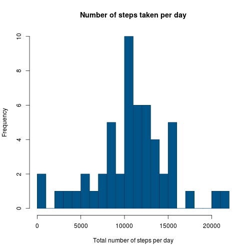

# Reproducible Research: Assignment 1

## Loading and preprocessing the data


```r
data <- read.csv("activity.csv")
stepsData <- data[["steps"]]

# Group number of steps per date (1)
stepsPerDay <- aggregate(data$steps, by=list(data$date), FUN=sum)
stepsPerDay <- setNames(stepsPerDay, c("Date", "StepsNum"))

# Group daily average number of steps per interval (2)
avgStepsPerInterval <- aggregate(data$steps, by=list(data$interval), FUN=mean, na.rm=TRUE)
avgStepsPerInterval <- setNames(avgStepsPerInterval, c("Interval", "StepsAvg"))

# DEBUG
#stepsPerDay
#avgStepsPerInterval
```

## What is mean total number of steps taken per day?


### Daily stats (steps per day):


- **Histogram of the total number of steps per day:**


```r
stepsDataHist <- as.integer(stepsPerDay[["StepsNum"]])
nbreaks <- max(stepsPerDay[["StepsNum"]], na.rm=TRUE)

# DEBUG
#stepsDataHist
#nbreaks

# Histogram
hist(stepsDataHist, freq=TRUE, 
	col="#005588", border="#003355", breaks=nbreaks / 1000,
	main="Number of steps taken per day", 
	xlab="Total number of steps per day", ylab="Frequency")
```

 

```r
# Mean and median computation
stepsMean <- mean(stepsPerDay[["StepsNum"]], na.rm=TRUE)
stepsMedian <- median(stepsPerDay[["StepsNum"]], na.rm=TRUE)
```

- **Mean number of steps per day:** 10766.19

- **Median number of steps per day:** 10765


## What is the average daily activity pattern?

### Average daily patterns (steps per interval):

 - **Time series for the daily average number of steps per interval:**


```r
# Time series
plot(avgStepsPerInterval[["Interval"]], y = avgStepsPerInterval[["StepsAvg"]], 
	type="l", main="Daily average number of steps per interval",
	xlab="Interval", ylab="Number of steps")
```

 

```r
# Maximum interval
intervalMaxAvgSteps <- which.max(avgStepsPerInterval[["StepsAvg"]])
intervalMaxAvgSteps <- avgStepsPerInterval[["Interval"]][intervalMaxAvgSteps]
```

- **Interval with the maximum average number of steps:** `835`


## Imputing missing values


## Are there differences in activity patterns between weekdays and weekends?
